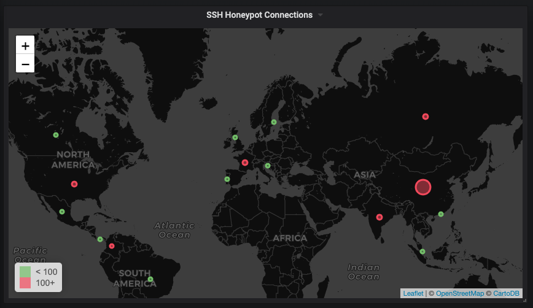

# ssh_honeypot_exporter

requires the log file from [droberson/ssh-honeypot](https://github.com/droberson/ssh-honeypot)

## docker

´´´
docker build -t konstfish/ssh_honeypot_exporter
docker run -p 9567:9567 -v /path/to/log/honeypot.json:/opt/honeypot.json konstfish/ssh_honeypot_exporter
´´´

## docker-compose

´´´
prometheus_ssh_honeypot:
    build: ./ssh_honeypot_exporter
    ports:
        - 9567:9567
    volumes:
        - /path/to/log/honeypot.json:/opt/honeypot.json
´´´